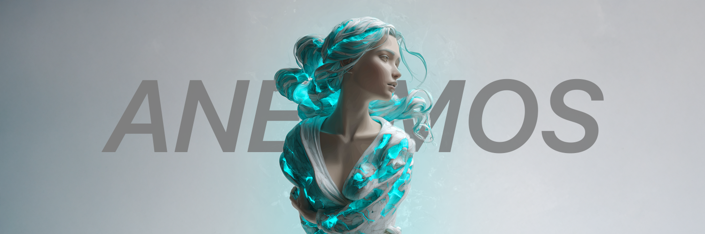

# Anemos

Anemos is a holding protocol designed for volatile token ecosystems. It rewards consistent onchain behavior-not snapshots, staking, or farming. Projects lock dev supply into our **Aether Vaults**, and supply is streamed to top holders over time based on signal.

---

## How It Works

- Projects connect their token to Anemos
- They lock a portion of dev supply into a vault
- Anemos Agents monitor holders onchain
- Tokens are distributed to consistent wallets over time

---

## Key Concepts

### Aether Engine
The core system that evaluates wallet behavior based on:
- Holding consistency
- Volatility resistance
- Interaction frequency (not volume)

### Aether Vaults
A reward system that streams locked supply to qualified holders. No claims, no snapshots-just passive reward flow.

### Signal Rating
An internal scoring system used to determine which wallets qualify for vault emissions.

---

## Structure

- `/src`: All logic for the Aether Engine, vault management, and agent behavior.
- `/docs`: Protocol specs, architecture breakdowns, and vision.
- `/scripts`: Simulations and utility scripts.

---

## Dev-Notes

- TypeScript project
- Solana-compatible wallet logic coming
- GitHub Contributions active starting June 2025

---

## License

MIT License

---

Follow our [Twitter ↗](https://x.com/AnemosLabs)
